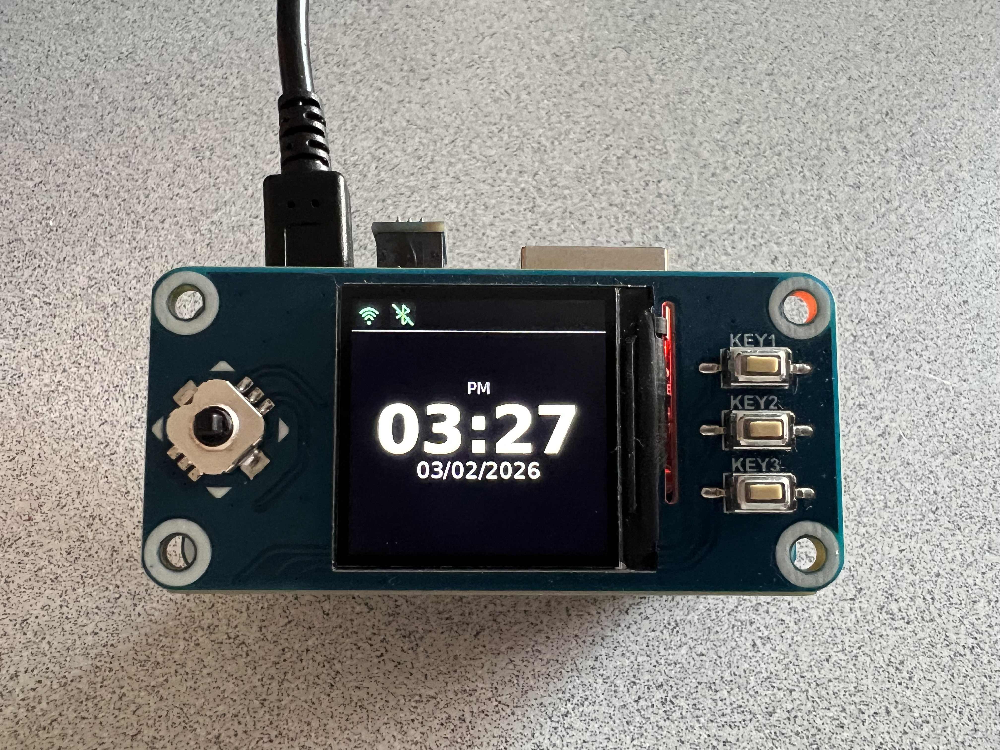
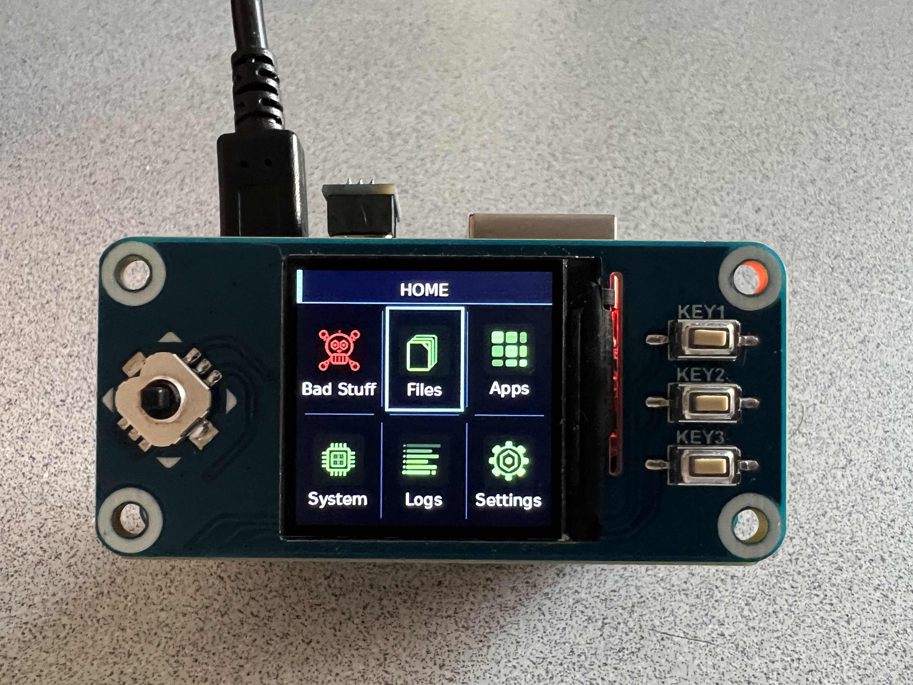
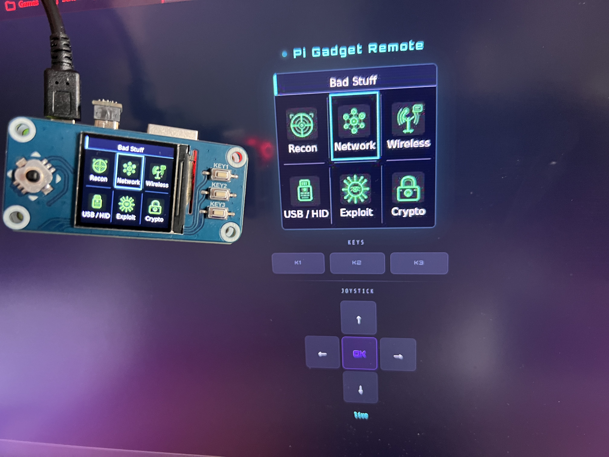
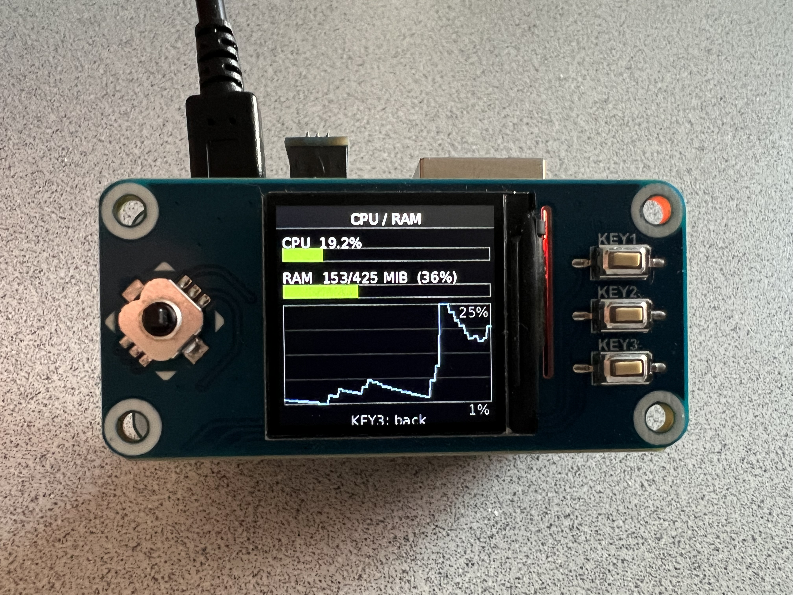
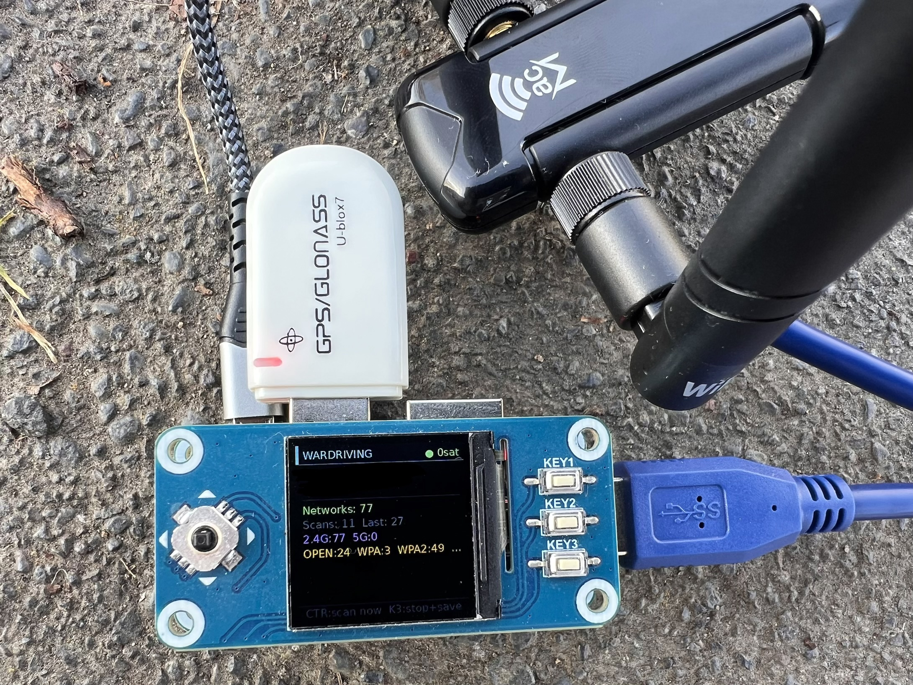
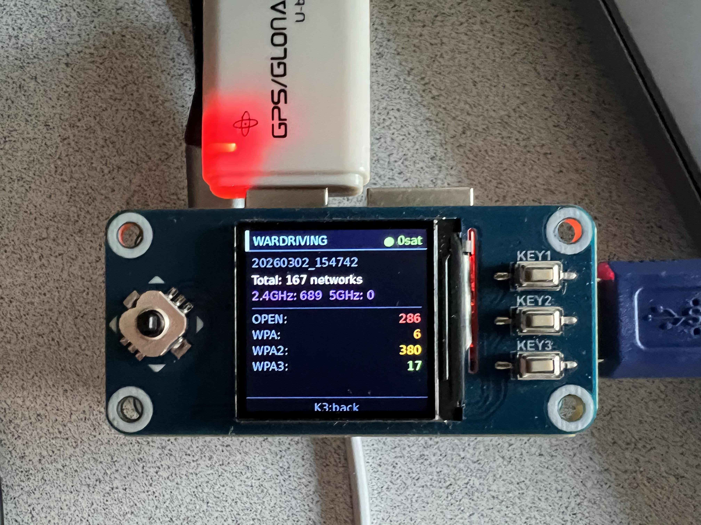
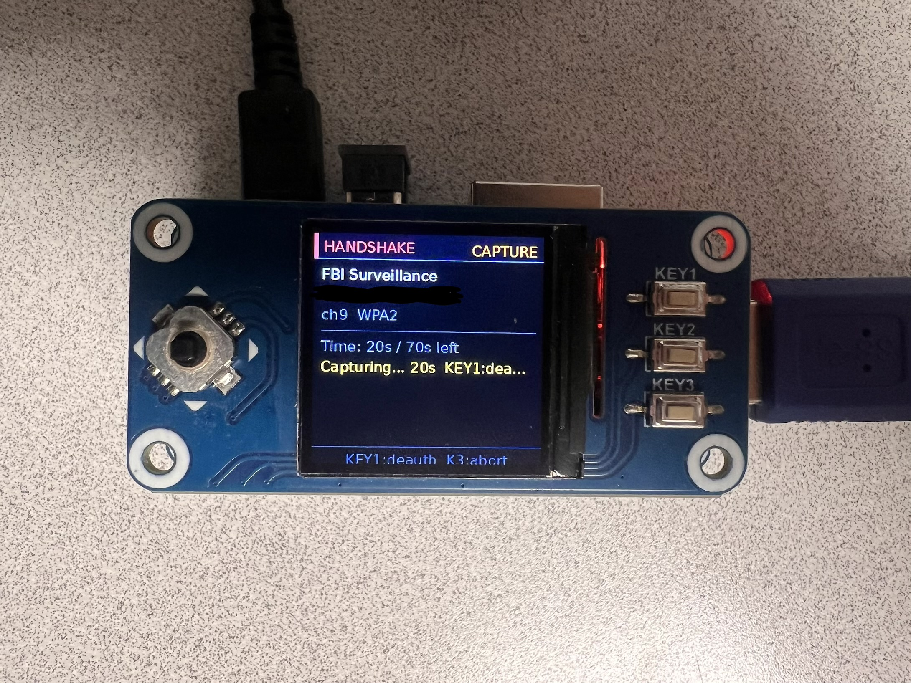

# Pi-gadget

Pi-gadget is a personal side project I work on in my free time.  
It is a small Raspberry Pi–based handheld device created to explore cybersecurity, system-level programming, hardware interaction, and custom interfaces.

The project is in active development and evolves gradually as I experiment and add new tools.

---

## 🧠 About the project

This project is built primarily for personal learning and hands-on experimentation with cybersecurity concepts.  
It is not intended to be a finished or polished product.

Development is incremental and driven by curiosity — exploring Linux internals, wireless protocols, USB HID attacks, GPS tracking, and building a custom GUI on embedded hardware.

---

## 🎯 Purpose

Pi-gadget is a handheld cybersecurity toolkit focused on learning through doing.  
It combines GPS wardriving, Wi-Fi recon, USB HID payload injection, rogue AP attacks, and system utilities — all controlled through a custom interface on a 240×240 display.

> ⚠️ **For authorized testing and educational use only.**  
> Do not use any tools against networks or devices you don't own or have explicit permission to test.

---

## 🛠️ Required hardware

The following components are **mandatory** for the project to work:

- **Raspberry Pi Zero 2 W** (with GPIO header)
- **Waveshare 1.3" LCD HAT** (ST7789-based, 240×240, with 5-way joystick + 3 buttons)

Without these components, the project will not function as intended.

---

## 🔌 Optional hardware

The following components are **optional** and enable additional features:

| Component | Enables |
|---|---|
| **Alfa AWUS036ACM** (MT7612U chipset) | Monitor mode, 5GHz wardriving, Evil Twin |
| **USB GPS dongle** (VK-172 / u-blox 7) | Wardriving with coordinates, GPS Map app |
| **Ethernet / USB Hub HAT** | Wired network, additional USB ports |

> Any Wi-Fi adapter supporting monitor mode on `wlan1` will work.  
> Compatible chipsets: MT7612U, MT7601U, RT5572, AR9271.  
> Without an external adapter, tools fall back to built-in `wlan0` (2.4GHz only, no monitor mode).

---

## 📸 Photos

<p align="center">
  
  &nbsp;&nbsp;
  
</p>
<p align="center"><em>Idle clock face &nbsp;&nbsp;&nbsp;&nbsp;&nbsp;&nbsp;&nbsp;&nbsp;&nbsp;&nbsp;&nbsp;&nbsp;&nbsp;&nbsp;&nbsp;&nbsp;&nbsp;&nbsp;&nbsp;&nbsp;&nbsp;&nbsp;&nbsp;&nbsp;&nbsp;&nbsp;&nbsp;&nbsp;&nbsp;&nbsp;&nbsp;&nbsp;&nbsp;&nbsp;&nbsp;&nbsp;&nbsp;&nbsp;&nbsp;&nbsp;&nbsp;&nbsp;&nbsp; Home menu</em></p>

---

<p align="center">
  
  &nbsp;&nbsp;
  
</p>
<p align="center"><em>Bad Stuff grid (with Remote UI) &nbsp;&nbsp;&nbsp;&nbsp;&nbsp;&nbsp;&nbsp;&nbsp;&nbsp;&nbsp;&nbsp;&nbsp;&nbsp;&nbsp;&nbsp;&nbsp;&nbsp;&nbsp;&nbsp;&nbsp;&nbsp;&nbsp;&nbsp;&nbsp;&nbsp;&nbsp; CPU / RAM monitor</em></p>

---

<p align="center">
  
  &nbsp;&nbsp;
  
</p>
<p align="center"><em>Wardriving in the field &nbsp;&nbsp;&nbsp;&nbsp;&nbsp;&nbsp;&nbsp;&nbsp;&nbsp;&nbsp;&nbsp;&nbsp;&nbsp;&nbsp;&nbsp;&nbsp;&nbsp;&nbsp;&nbsp;&nbsp;&nbsp;&nbsp;&nbsp;&nbsp;&nbsp;&nbsp;&nbsp;&nbsp;&nbsp;&nbsp;&nbsp;&nbsp;&nbsp;&nbsp;&nbsp;&nbsp;&nbsp;&nbsp;&nbsp;&nbsp;&nbsp;&nbsp;&nbsp;&nbsp;&nbsp; Session stats</em></p>

---

<p align="center">
  
</p>
<p align="center"><em>WPA2 handshake capture</em></p>

---

## 📂 Menu structure

```
HOME
├── Bad Stuff               ← Hacking tools (icon grid)
│   ├── Recon
│   │   ├── Wardriving      — GPS Wi-Fi mapping, WiGLE CSV + GPX export
│   │   ├── Net Intel       — Network scanner + OS fingerprinting
│   │   ├── Handshake       — WPA2 handshake capture + deauth
│   │   └── Harvester       — Passive overnight handshake collector
│   ├── Network
│   │   └── Evil Twin       — Rogue AP + captive portal + credential logging
│   ├── Wireless
│   │   └── MAC Changer     — Spoof MAC address on any interface
│   ├── USB / HID
│   │   └── Payloads        — Ducky Script 3.0 BadUSB injector
│   ├── Exploit             — (coming soon)
│   └── Crypto              — (coming soon)
├── Files                   ← File browser (payloads, portals, wardriving logs)
├── Apps
│   └── Map                 — Live GPS map using OpenStreetMap tiles
├── System                  ← CPU, RAM, Disk, Temperature, Reboot, Shutdown
├── Logs                    ← (coming soon)
└── Settings                ← Wi-Fi, Bluetooth, Brightness, Date/Time, USB Mode
```

---

## 🚀 Setup

**1. Enable SPI:**
```bash
sudo raspi-config
# Interface Options → SPI → Enable
sudo reboot
```

**2. Clone and install:**
```bash
git clone https://github.com/markkhanch/pi-gadget.git
cd pi-gadget
bash install.sh
sudo reboot
```

**3. Run:**
```bash
python3 main.py
```

---

## 🕹️ Controls

| Input | Action |
|---|---|
| Joystick UP / DOWN / LEFT / RIGHT | Navigate grid / scroll list |
| CENTER (press joystick) | Select / confirm |
| K1 | Context action (varies per app) |
| K2 | Options menu (in file browser) |
| K3 | Back / Exit |

---

## 📁 Project structure

```
pi-gadget/
├── main.py                  — Main event loop and state machine
├── install.sh               — Automated setup script
├── requirements.txt         — Python dependencies
├── apps/
│   ├── bad_stuff/           — recon, network, wireless, usb, exploit, crypto
│   ├── general/             — map and future general apps
│   ├── system/              — cpu_ram, device_info, disk, temp
│   └── settings/            — wifi_manager, bluetooth, brightness, etc.
├── core/                    — Hardware driver, fonts, input, menu loader
├── ui/                      — Main menu, list view, options, keyboard
├── assets/icons/            — PNG icons
└── menu_fs/                 — App launcher filesystem
    ├── 01_hacking/          — Bad Stuff (opens as icon grid)
    ├── 02_files/            — Files root
    ├── 03_apps/             — Apps root
    ├── 04_system/           — System tools
    ├── 05_logs/             — Logs (future)
    └── 06_settings/         — Settings
```

---

## 📄 License

See [LICENSE](LICENSE).
